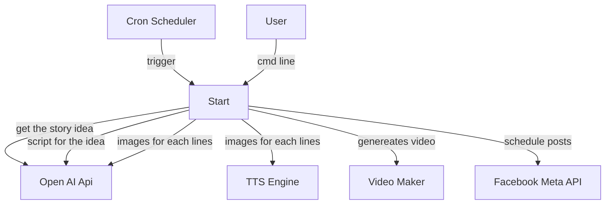

# ai-vaia
AI Vaia

## Release V1
Barebone proof of concept idea

A cron running daily and scheduling to "AI Vaia" Facebook page. The schedule should be 7 days later. 

**Concerns**
* Simple script and less deployment dependency
* Barebone pipeline to test the automatic posting idea via bots
* With next week schedule, we can go to facebook page and see upcoming schedueld posts and do manual verification. This will reduce our initial effort of building approval infrastructure.

**Control Flow**

## Release V2
Campaign Manager
